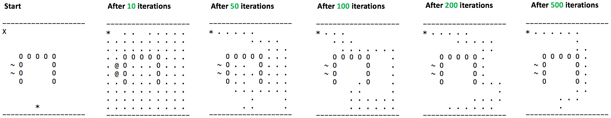

## Overview

In this project I implemented the Q-Learning solutions to a reinforcement learning problem. I applied them to a navigation problem in this project.

## Results




## Implement Q-Learner

My QLearner class was implemented in the file QLearner.py. It implemented the API defined below. QLearner class implemented the following methods:

The **constructor QLearner()** reserves space for keeping track of Q[s, a] for the number of states and actions. It initializes Q[] with all zeros. Details on the input arguments to the constructor:
* num_states integer, the number of states to consider
* num_actions integer, the number of actions available.
* alpha float, the learning rate used in the update rule. Should range between 0.0 and 1.0 with 0.2 as a typical value.
* gamma float, the discount rate used in the update rule. Should range between 0.0 and 1.0 with 0.9 as a typical value.
* rar float, random action rate: the probability of selecting a random action at each step. Should range between 0.0 (no random actions) to 1.0 (always random action) with 0.5 as a typical value.
* radr float, random action decay rate, after each update, rar = rar * radr. Ranges between 0.0 (immediate decay to 0) and 1.0 (no decay). Typically 0.99.
* dyna integer, conduct this number of dyna updates for each regular update. When Dyna is used, 200 is a typical value.
* verbose boolean, if True, your class is allowed to print debugging statements, if False, all printing is prohibited.
**query(s_prime, r)** is the core method of the Q-Learner. It should keep track of the last state s and the last action a, then use the new information s_prime and r to update the Q table. The learning instance, or experience tuple is <s, a, s_prime, r>. query() should return an integer, which is the next action to take. Note that it should choose a random action with probability rar, and that it should update rar according to the decay rate radr at each step. Details on the arguments:
* s_prime integer, the the new state.
* r float, a real valued immediate reward.

**querysetstate(s)** A special version of the query method that sets the state to s, and returns an integer action according to the same rules as query() (including choosing a random action sometimes), but it does not execute an update to the Q-table. It also does not update rar. There are two main uses for this method: 1) To set the initial state, and 2) when using a learned policy, but not updating it.

Here's an example of the API in use:
```
import QLearner as ql

learner = ql.QLearner(num_states = 100, \
    num_actions = 4, \
    alpha = 0.2, \
    gamma = 0.9, \
    rar = 0.98, \
    radr = 0.999, \
    dyna = 0, \
    verbose = False)

s = 99 # our initial state

a = learner.querysetstate(s) # action for state s

s_prime = 5 # the new state we end up in after taking action a in state s

r = 0 # reward for taking action a in state s

next_action = learner.query(s_prime, r)
```
